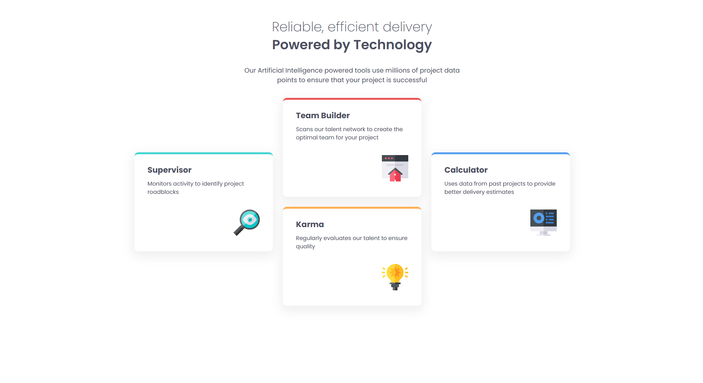

# Four Card Feature Section

## 📌 Overview
The **Four Card Feature Section** challenge was a layout-based challenge designed for beginners. This project tests the ability to create a **multi-column, responsive layout** while using CSS Grid to position elements in unique ways.

## 🎯 Objectives
- Learn how to create a **responsive** website.
- Use **CSS Grid** to place elements in **unusual** but structured positions.
- Improve understanding of **clamp()** for responsive typography.
- Experiment with **CSS variables** and **reset templates** for maintainable styles.

## 🛠️ Technologies Used
- **HTML5**
- **CSS3** (including Grid, Flexbox, Variables, and Reset Styles)

## 📸 Screenshot


## 🚀 Live Demo
Check out the live project here: **[Four Card Feature Section](https://jayco01.github.io/four-card-feature/)**

## 📂 Repository
GitHub Repo: **[four-card-feature](https://github.com/jayco01/four-card-feature.git)**

## 🏆 Challenges Faced
One of the biggest challenges was **learning CSS Grid for the first time**. Understanding how to **name each grid cell** and apply `grid-template-areas` was initially confusing. However, after experimenting and adjusting layouts, I gained confidence in defining and positioning grid elements correctly.

## 🎓 Lessons Learned
Through this project, I learned:
- How to **use CSS Grid effectively**.
- How to **name grid cells** and properly structure `grid-template-areas`.
- How to **analyze a Figma/web design and translate it into a functional grid layout**.
- Improved my use of **clamp()** for responsive typography.
- Implemented **Andy Bell's CSS reset template**, which could save **hours of styling adjustments**.
- Learned to use **CSS Variables (`:root`)** for the first time.

## 🔥 Future Improvements
- **Enhance CSS Grid skills** to build more complex layouts.
- **Improve usage of clamp()** for even better responsive design.
- Continue building **responsive websites** efficiently.

## 📚 Resources & Credits
I learned CSS Grid through the following YouTube tutorials:
- [Learn CSS Variables in 7 Minutes](https://www.youtube.com/watch?v=5wLrz_zUwoU) by **Slaying The Dragon**
- [Why CSS grid-area is the best property for laying out content](https://www.youtube.com/watch?v=duH4DLq5yoo) by **Kevin Powell**

## 🏗️ How to Run the Project Locally
1. Clone the repository:
   ```sh
   git clone https://github.com/jayco01/four-card-feature.git
   ```
2. Open the project folder:
   ```sh
   cd four-card-feature
   ```
3. Open `index.html` in a browser.

---

🚀 **Thank you for checking out my project!** Feel free to fork the repo or provide feedback to help me improve. 😊
